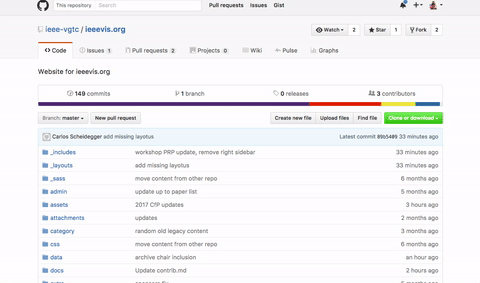
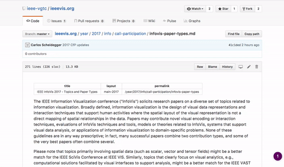
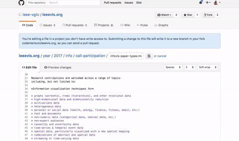
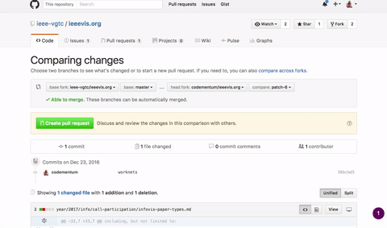

# Contributing

Thank you for helping with the vis website. The easiest way for you to
contribute to the website is to edit the file directly in your
browser. What will happen behind the scenes after you're done with an
edit is that GitHub will automatically create a "pull request" from
your edit, which will let us know that you would like to update some
of the
content. [Here](https://help.github.com/articles/editing-files-in-another-user-s-repository/)
is a simple guide.

## Where are the current files?

Here is an example link for the [2016 workshops page](https://github.com/ieee-vgtc/ieeevis.org/blob/master/year/2016/info/call-participation/workshops.md). Other URLs are available in similar places: [posters](https://github.com/ieee-vgtc/ieeevis.org/blob/master/year/2016/info/call-participation/posters.md), [panels](https://github.com/ieee-vgtc/ieeevis.org/blob/master/year/2016/info/call-participation/panels.md). Note how the URL on GitHub matches the URL on the website. https://github.com/ieee-vgtc/ieeevis.org/blob/master/year/2016/info/call-participation/panels.md corresponds to http://staging.ieeevis.org/year/2016/info/call-participation/panels (remove "/blob/master/" and the ".md" extension).

## By default, web chairs are not responsible for content

Please do not contact web chairs with requests that include decisions 
over content. For example, "improve the text on page XYZ" is not a
reasonable request to be made to web@ieeevis.org; it's a request to be
made to whoever is the responsible party.

Please do not contact web chairs with requests such as "please add
this content to the web site. You can decide where it goes". The web 
chairs are responsible for making sure the website is running smoothly,
together with the rest of the web infrastructure. They are not responsible
for content. You should contact them with, at least:

- the URL where you want the page to go,
- the specific content it should be there,
- and the person who will be in charge of maintaining that content in the future.

## Who's responsible for what?

The point-of-contact for each page in the website is the
`contact` person in each page's front matter. If a page does not have
an assigned contact, then 1) that's likely a bug that should be
reported, 2) `web@ieeevis.org` is the default point-of-contact.

This means that if you found a bug on the *content* of a webpage,
you're welcome to create a pull request for the content to get
fixed. However, if the fix involves anything more than trivial typos,
we will wait for an OK from the point-of-contact before committing the
changes.

## What's with the content files all over the place?

This is the result of five years of legacy pages written atop of each
other. We're slowly improving the situation, but the legacy content is
currently quite messy. Pull requests are welcome.

## Contribution Guide: Step by Step

We're going to use the [InfoVis CFP](https://github.com/ieee-vgtc/ieeevis.org/blob/master/year/2016/info/call-participation/infovis-papers.md) as an example.

The basic workflow is: make changes to plain-text files using the in-browser text editor, and submit them for review by the web team and chairs.

### 1. Identify the file you want to change

Use the GitHub file browser to find the InfoVis CFP.
You can also use the search bar at the top of the GitHub page to find files by key phrases or filenames.

### 2. Make edits in browser

Use GitHub's in-browser text editor to make changes to the files.
After selecting a file, click the edit button (upper right in the file viewer) to access the editor and make changes.

### 3. Propose file changes

After making changes, scroll to the bottom of the page to propose changes to the original document.
The text fields are optional, but recommended.
Use the text fields to summarize the changes you've made.

### 4. Submit proposed changes for review

Create a Pull Request to submit your changes for review by the web team and chairs.
