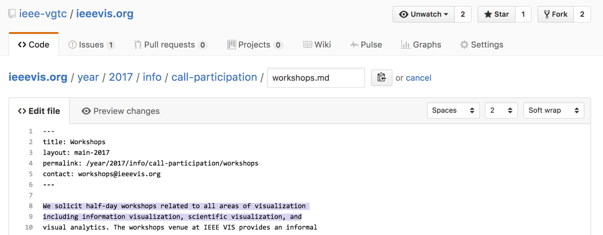
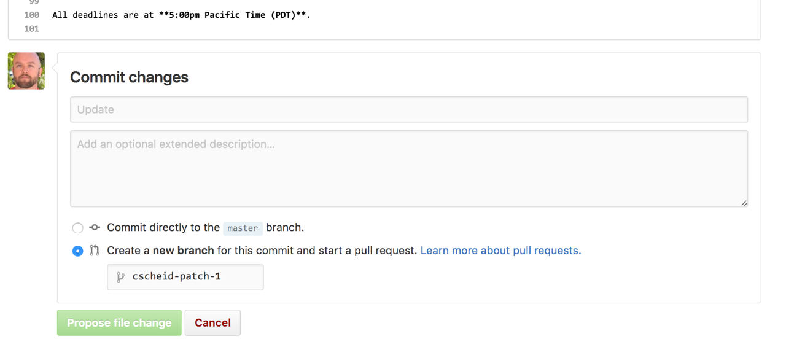
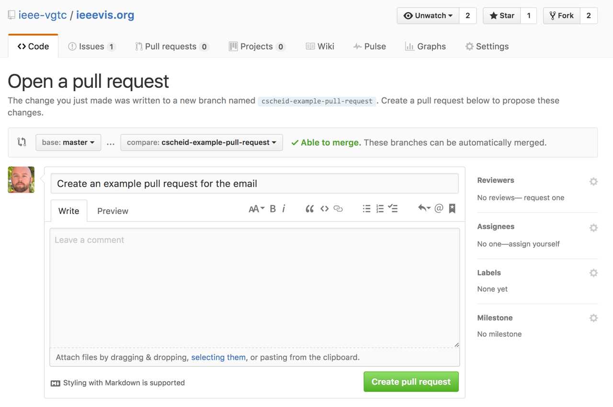
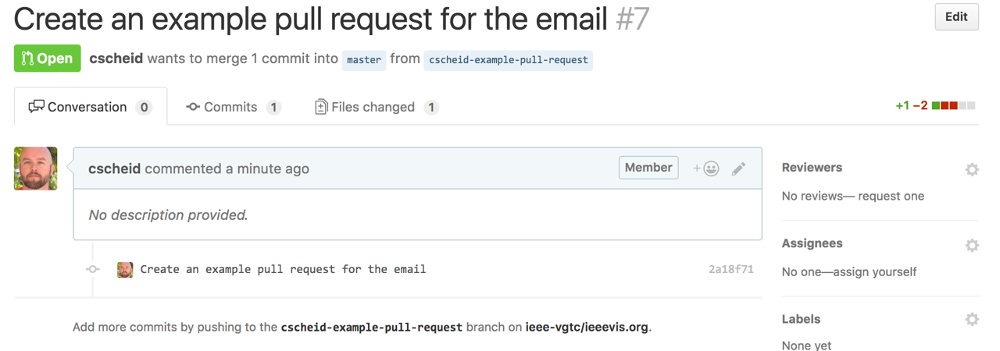

# Contributing

Thank you for helping with the ieeevis.org website. The easiest way
for you to contribute to the website is to edit the file you want to
change, directly in your browser.  What will happen behind the scenes
after you're done with an edit is that GitHub will automatically
create a "pull request" from your edit, which will let us know that
you would like to update some of the
content. [Here is a simple guide](https://help.github.com/articles/editing-files-in-another-user-s-repository/)
to editing files in another user's repository.

## How to change an existing page

Here's a video that illustrates the same process described in the text below:

<video width="480" controls>
<source 
  src="attachments/pull-request-tutorial-web.mp4" 
  type="video/mp4">
</video>

The *easiest* way to suggest a change is to go on the bottom of the page you want to change and click on “file a bug”. You will be taken to the GitHub website where you can describe the problem, and web@ will get a notification when the bug is filed.

The *best* way to suggest a change is to go on the bottom of the page you want to change and click on “suggest a fix”. You will again be taken to GitHub. For this one you will be asked to log in to a GitHub account. After you do so, you will be shown an interface that looks like this:

After you’re done making the edits, you’ll go to the bottom of the page where there’s this:

After you click on "Propose file change", you’ll be taken to something that looks like this, where you can click on "Create Pull Request":

After you click on that, web gets both a bug report and a proposed change:

If the change is simple, we’ll simply say "OK". If the change requires reviewers, we can ask for people to comment on the thread. After everyone says OK, we merge the change and then we will be able to push it to staging.ieeevis.org

## Staging vs Production

In case you’re wondering how we go from staging.ieeevis.org to ieeevis.org, there is effectively no difference between staging and production. 

In other words, all of the discussion we've had here applies to production as well. 
(From our side, the difference between pushing to staging and pushing to production is "make staging" vs "make production").

## Where are the current files?

Here is an example link for the [2016 workshops page](https://github.com/ieee-vgtc/ieeevis.org/blob/master/year/2016/info/call-participation/workshops.md). 
Other URLs are available in similar places: [posters](https://github.com/ieee-vgtc/ieeevis.org/blob/master/year/2016/info/call-participation/posters.md), [panels](https://github.com/ieee-vgtc/ieeevis.org/blob/master/year/2016/info/call-participation/panels.md). 

Note how the URL on GitHub matches the URL on the website. https://github.com/ieee-vgtc/ieeevis.org/blob/master/year/2016/info/call-participation/panels.md corresponds to http://staging.ieeevis.org/year/2016/info/call-participation/panels (remove "/blob/master/" and the ".md" extension).

## Policies

### By default, web chairs are not responsible for content

Please do not contact web chairs with requests that include decisions over content. For example, "improve the text on page XYZ" is not a reasonable request to be made to web@ieeevis.org; it's a request to be made to whoever is the responsible party.

Please do not contact web chairs with requests such as "please add this content to the web site. You can decide where it goes". The web chairs are responsible for making sure the website is running smoothly, together with the rest of the web infrastructure. They are not responsible for content. You should contact them with, at least:

- the URL where you want the page to go,
- the specific content it should be there,
- and the person who will be in charge of maintaining that content in the future.

### Who's responsible for what?

The point-of-contact address for each page in the website is the contact
email address in each page's front matter (which is visible on each page by
looking at the footer). 

If a page does not have an assigned contact, then 1) that's likely a
bug that should be reported, 2) web@ieeevis.org is the default
point-of-contact.

This means that if you found a bug on the content of a webpage, you're
welcome to create a pull request for the content to get
fixed. However, if the fix involves anything more than trivial typos,
we will wait for an OK from the point-of-contact before committing the
changes.

### What's with the content files all over the place?

This is the result of five years of legacy pages written atop of each other. We're slowly improving the situation, but the legacy content is currently quite messy. Pull requests are welcome.

# How to compare staging and production files

This link [compares staging and production branches](https://github.com/ieee-vgtc/ieeevis.org/compare/production).

