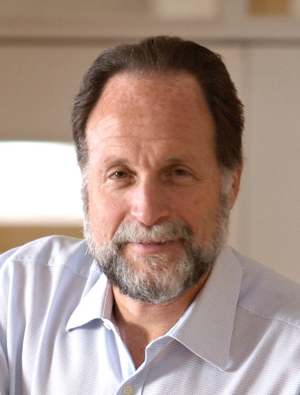

<table border="0" cellpadding="2" width="800"><tbody>
<tr>
  <td width="247" align="center" valign="middle"></td> 
  <td width="539" align="left" valign="bottom">
<strong>Keynote Talk</strong>

  
<strong>Tuesday, October 25, 2016 </strong>  <strong>8:30 AM –
9:30 AM</strong>  <strong>Key Ballroom</strong>

<strong>Prof. Ricardo Hausmann</strong> 
Ricardo Hausmann is Director of Harvard's Center for International
Development and Professor of the Practice of Economic Development at
the Kennedy School of Government. Previously, he served as the first
Chief Economist of the Inter-American Development Bank (1994-2000),
where he created the Research Department. 
</td></tr>
<tr>
	<td colspan="2">He has served as Minister of Planning of Venezuela (1992-1993) and as a member of the Board of the Central Bank of Venezuela. He also served as Chair of the IMF-World Bank Development Committee. He was Professor of Economics at the Instituto de Estudios Superiores de Administracion (IESA) (1985-1991) in Caracas, where he founded the Center for Public Policy. His research interests include issues of growth, macroeconomic stability, international finance, and the social dimensions of development. He holds a PhD in economics from Cornell University.</td>
</tr> 
</tbody></table>
