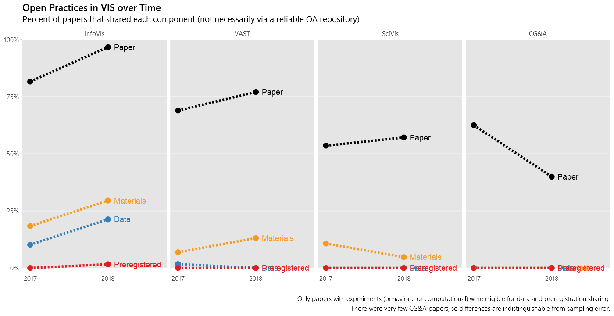
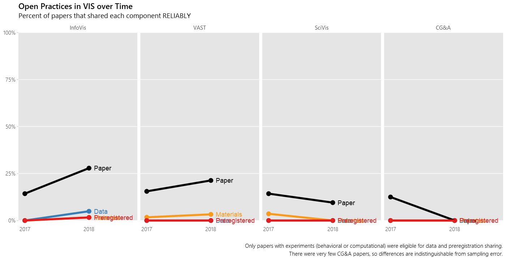

[back to Open Practices index](open-practices)  

This page tracks the state of open practices at VIS. For details on data collection, see ([Haroz 2018](https://osf.io/8ag3w/)).

Reliable means that the artifact is stored in a reliable open practice repository rather than a personal webpage or github project.

 These images by <a xmlns:cc="http://creativecommons.org/ns#" href="http://steveharoz.com" property="cc:attributionName" rel="cc:attributionURL">Steve Haroz</a> are licensed under a <a rel="license" href="http://creativecommons.org/licenses/by/4.0/">Creative Commons Attribution 4.0 International License</a>.
