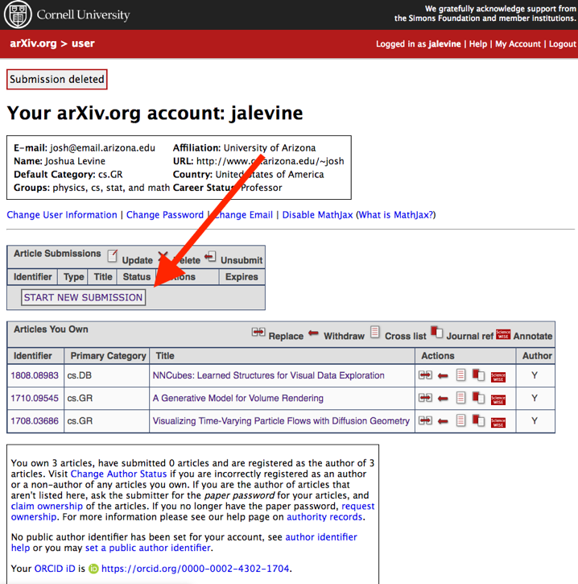
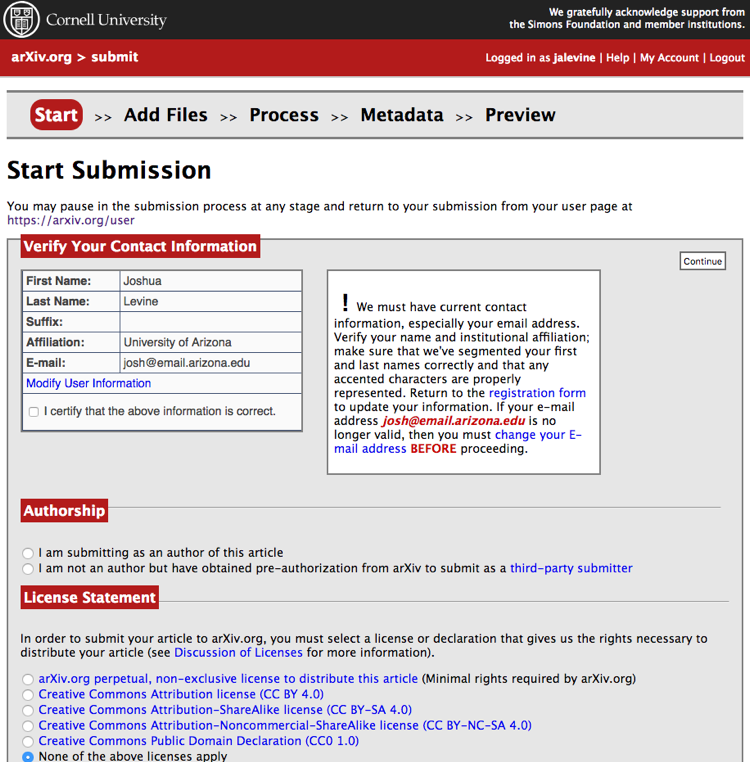
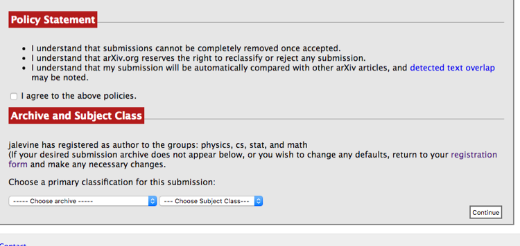
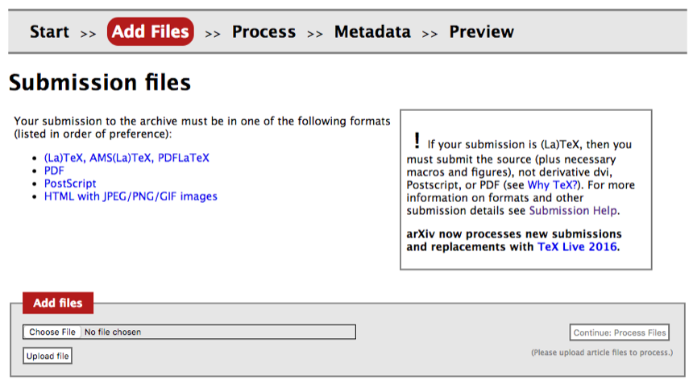
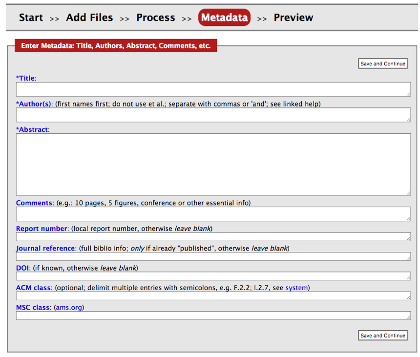
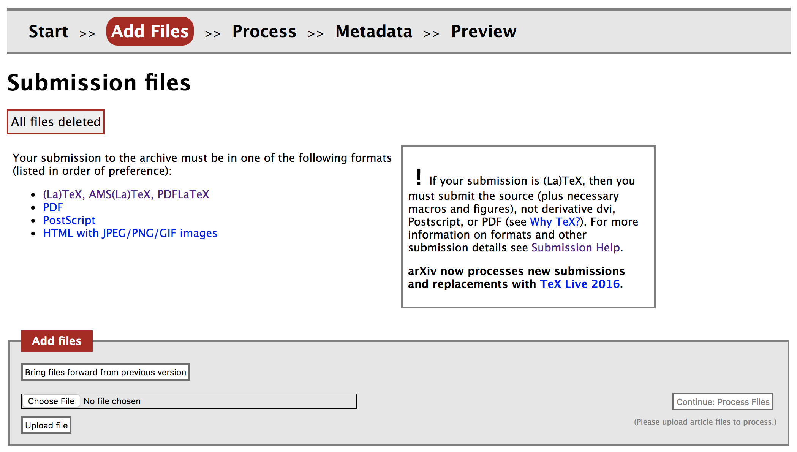

# How to share a paper via arXiv.org
*This section was written by Joshua Levine and further edited by the Open Practice chairs.*
 
Note that this document is just a summary, please see [https://arxiv.org/help/submit](https://arxiv.org/help/submit) for the complete information. For information about arXiv’s licensing requirements please see [https://arxiv.org/help/license](https://arxiv.org/help/license).

## Step-1.Register as an author
See: [https://arxiv.org/user/register](https://arxiv.org/user/register)
 
You will need:

- An email address, username and password
- Some personal information such as current affiliation and default categories you will submit to.

**Important note:** If possible, it is preferred to use an official email address when registering, e.g., one finishing with *.gov, .edu, .ac.uk, etc.*. The reason is that emails coming from official accounts seem to be getting through [arXiv's endorsement process](https://arxiv.org/help/endorsement) more easily (see the discussion on Step-3 below on endorsements).

## Step-2.Create a new submission
After your account is created, you can view your current submissions and create new ones from
[https://arxiv.org/user/](https://arxiv.org/user/)

**Note for Overleaf users (!):**  If you are using Overleaf, the easiest way to prepare a submission is to use the "Submit" button on Overleaf and scroll down to arXiv, download a zip file with all the needed files for your paper, and then click on the Submit button that takes you directly to arXiv pages for a new submission. Also see **Note-2** below.

  

## Step-3.Complete the submission process
 
a) Choose a license (the default arXiv license is recommended by IEEE)
 
 
 
 
Note that you may need endorsement in a category if it is the first time you’ve submitted to arXiv.org, especially in this category.  See [https://arxiv.org/help/endorsement](https://arxiv.org/help/endorsement).  

**Important:** Getting the endorsement might take some time in certain cases, so please make sure that you consider this in your planning for putting your preprint up.
 
There is currently no category explicitly for visualization. Some categories to consider might be: *cs.HC: Human Computer Interaction, cs.GR: Graphics or cs.LG:Learning*, however, feel free to choose any other category that best fits your paper.
 
b) Upload the pdf in the correct format, or alternatively in (La)Tex. Note that if the paper is generated using (La)Tex, arXiv won't accept the pdf format so you will need to submit using the `TeX/LaTeX` format. 

**Important:** Please refer to **Note-1** at the end of the document for further guidance on submitting in `TeX/LaTeX` format.

 
 
c) Complete the metadata (title, abstract, authors)

 
 
d) After previewing, the system may need to process for a few minutes before you will have the option to submit it from the preview section.

## Step-4.Wait for Processing by arXiv     
After the submission is processed, keep an eye out for an email from arXiv.org that provides a unique identifier for the paper.  You can share this with your co-authors so that they can add it to their list of articles that they own.

## Step-5.Update arXiv record post publication 
Once your paper is processed for publication by IEEE (post final acceptance) and after you receive the DOI, you must post an IEEE copyright notice on your preprint. According to IEEE author FAQ, you can replace the preprint with either: 1) the full citation to the IEEE work with Digital Object Identifiers (DOI) or a link to the paper’s abstract in IEEE Xplore, or 2) the accepted version only (not the IEEE published version), including the IEEE copyright notice and full citation, with a link to the final, published paper in IEEE Xplore.

After you follow the guidance on the [Open Access Preprint Guide and FAQ](open-practices-faq) under the "**Which version of the paper can I share?**" question and produced a pdf with a DOI link and copyright statement on it, you will also need to revise the version on arXiv. 

When revising the article on arXiv, you can follow the following steps:

* Login to arXiv, and you should see your paper under "Articles You Own"
* Under the "Actions" menu, click the "Replace" icon.
* Once you are on the "Add Files" tab, select the "Bring files forward from previous version" to replace the `TeX` files. However, if you originally were able to submit a pdf directly, you can upload the pdf directly at this stage.

 

* [If you are uploading `TeX` files] Replace the `vgtc.cls` file with the revised `vgtc.cls` file included in the [updated `laTeX` template here](http://junctionpublishing.org/vgtc/Track/vis-menu.html)
* [If you are uploading `TeX` files] Replace your main `.tex` file since it should now have a line `\ieeedoi` with your DOI
* [If you are uploading `TeX` files] If you have changed any other `TeX` file, also make sure that you replace those as well
* Once arXiv processed your pdf, and you are on the "Metadata" tab. arXiv has [guidance here](https://arxiv.org/help/prep) to support you in entering information here. For VIS papers, make sure to include the following information on this tab:
	* Enter the paper's DOI. arXiv has some guidance [here](https://arxiv.org/help/jref).
	* Include ACM classification keywords. Note that arXiv supports only the [1998 classification](https://www.acm.org/publications/computing-classification-system/1998) in the meta data (*H. Information Systems* and *I. Computing Methodologies* are good starting points).
	* Under the comments section, add a reference to IEEE VIS. You can also add [ACM 2012 classification keywords](https://www.acm.org/publications/class-2012) as the ACM 2012 classification is more representative of visualization research. The comment note could look like (choose one of "InfoVis/VAST/SciVis" and relevant keywords): 
	
		>IEEE VIS (InfoVis/VAST/SciVis) 2019
		>
		>ACM 2012 CCS - Human-centered computing, Visualization, Visualization design and evaluation methods
	* Even though it is for papers on the math archive, you can include a [Mathematics Subject Classification](http://www.ams.org/msc/) as well. `68Uxx` offers some potential candidates
* Once done, arXiv should process your revision in a few days and notify you.

Support pages from arXiv provide further guidance on the replacement process [here](https://arxiv.org/help/replace)

## Further guidance

### Note-1: Submitting articles in  `TeX/LaTeX` format
arXiv prefers articles to be submitted in `TeX/LaTeX` format for reasons of stability and portability. If you are submitting in this format, you will notice that arXiv has some expectations to make things work smoothly. The arXiv guidance on this is helpful: [https://arxiv.org/help/submit_tex](https://arxiv.org/help/submit_tex).

In the following, we are highlighting a number of issues and key steps to be aware when submitting to arXiv in `TeX/LaTeX` format:

**Renaming ``.tex`` files** If you have multiple files, arXiv usually infers what your main file is, however, you can name the main TeX file `ms.tex` to make sure that it is the file that is processed first. Note that you will need to rename your `.bib` file as `ms.bib` as well. 

**Getting references to work, i.e., including the `bbl` file:** One step that needs pointing out here is the requirement to use `.bbl` files to get your references included in the output. This is due to arXiv's compiler not running the BibTeX command. Luckily, tt's easy to produce the `.bbl` file. Once you compile your paper in any TeX editor, the `.bbl` file should be in the directory as a bi-product, just include that in the files to be submitted to arXiv. Make sure that the `.bbl` file has the same name as the main `.tex` file.

**Submitting files in bulk:** One step you might find tedious is to submit all the individual files separately. What you can do speed this up is to submit a packaged folder with all your files. The arXiv manual provides further guidance [here](https://arxiv.org/help/submit_tex):

>*You can submit a collection of TeX input/include files, e.g. separate chapters, foreword, appendix, etc, and custom macros (see below) packaged in a (possibly compressed) .tar or .zip file. AutoTeX will generally figure out how to properly process multi-part submissions, and you don't need to adhere to special packaging rules or naming conventions for your tex files. However, there are certain caveats. Naming your primary (or toplevel) file ms.tex will cause AutoTeX to always process that file first. Otherwise, tex files will be processed in alphanumeric order.*

Or you can upload `tex` files separately and then put all images in a `zip` file and upload. Note that the relative paths for images should be correct. For example, if you have all images in a folder called "*figs*", then you can upload "*figs.zip*" and it should work.

**File size limits:** arXiv has file size limits as explained [here](https://arxiv.org/help/sizes). The current limitation is either 10MB for your output file or for an individual file (i.e., you'll get a warning if any of the files you are submitting is larger than 10 MB). This could be problematic if you have large figures. You can try to make your figure sizes smaller to overcome that (arXiv has some guidance on that [here](https://arxiv.org/help/bitmap)). If you cannot get sizes down below the limit, arXiv still accepts your submission but you need to drop the administrators an email as suggested [here](https://arxiv.org/help/sizes).

**Compilation error that mentions "00README.XXX":** You might get a compilation error from arXiv's TeX compiler due to a clash between arXiv's `HyperTeX` package with a few style and class files. If that's the case, this will be highlighted in the error logs. You can add a new file named `00README.XXX` and add the text `nohypertex` in it to address this issue.

**Other common mistakes:** There are a few other issues that can make the autocompiler break. [This guidance](https://arxiv.org/help/faq/mistakes) on arXiv highlights those common mistakes and your issue might be mentioned in there as well.

### Note-2: Overleaf users

**When creating a submission:** If you are using Overleaf, the easiest way to prepare a submission is to use the "*Submit*" button on Overleaf and scroll down to arXiv, download a zip file with all the needed files for your paper, and then click on the *Submit* button that takes you directly to arXiv pages with a new submission created. You can then follow Step-3 and onwards in the main guidance.

Alternatively, Overleaf provides you a zip file for streamlining your arXiv submission by providing this `.zip` file available for download. You can simply download the `.zip` file and it will have all the files needed, including the `.bbl` file for the references.

**When revising a submission (i.e., following Step-5):** Overleaf does not offer a "*resubmit*" button. You will need to download a `zip` file and replace the files on arXiv that has changed following the above guidance on **Step-5**.
